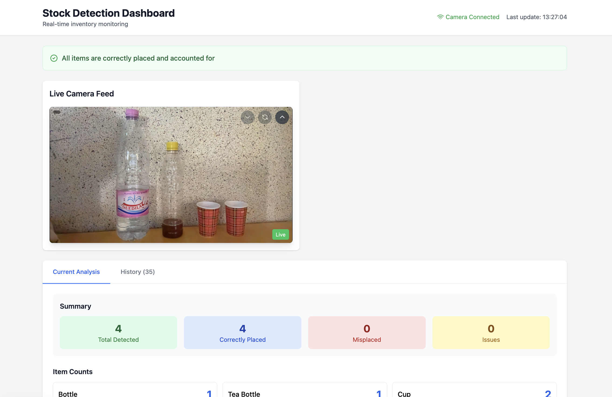
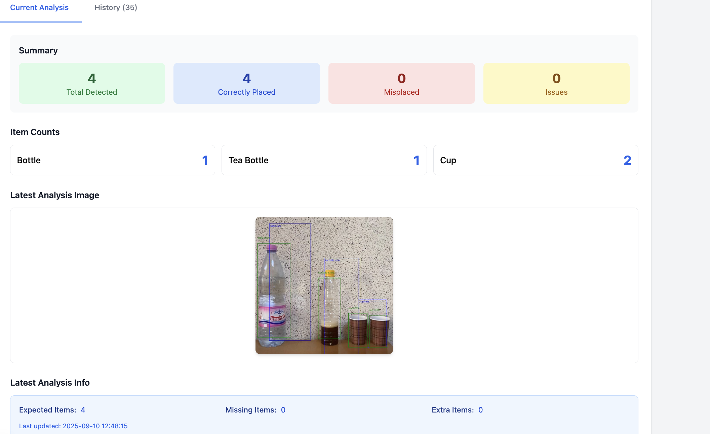
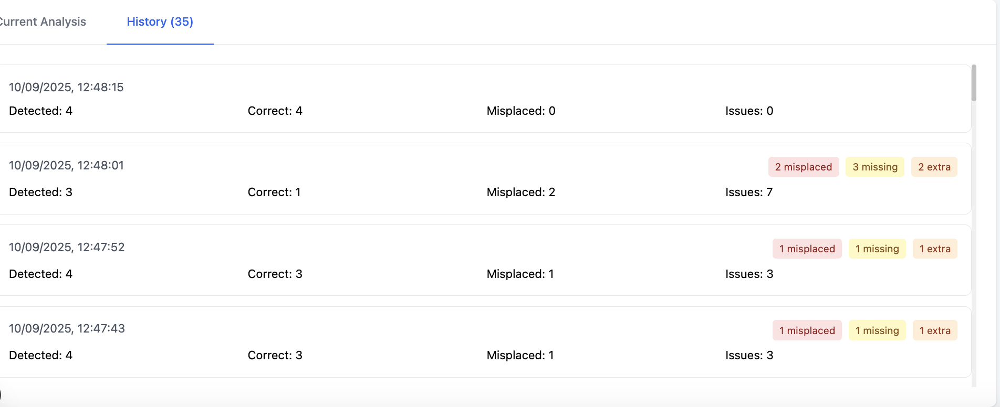

# Smart Agriculture Inventory System

A comprehensive real-time inventory monitoring system designed for smart agriculture applications, featuring edge computing, custom object detection, and a responsive web dashboard. This system enables farmers and agricultural professionals to automatically monitor inventory levels, detect misplaced items, and receive instant alerts.

## 🌟 Key Functionalities
- Real-time Monitoring
  * Live Video Streaming: View real-time camera feed from agricultural robots or fixed monitoring points

  * Instant Object Detection: Identify agricultural items (bottles, containers, tools) with custom-trained models

  * Continuous Analysis: Automatic periodic inventory checks (configurable interval)

- Intelligent Inventory Management
  * Smart Shelf Zoning: Define expected locations for different item types

  * Placement Validation: Automatically detect misplaced items

  * Stock Level Monitoring: Track missing and extra items in real-time

  * Perishable Items Tracking: Special alerts for time-sensitive agricultural products

- Advanced Visualization
  * Interactive Dashboard: Responsive web interface with real-time data

  * Historical Analytics: View trends and patterns over time

  * Annotated Images: Visual representation of detection results with bounding boxes


## 🎯 Real-World Use Cases
- Greenhouse Management
  * Seedling Tray Monitoring: Track inventory of seedling containers and propagation materials

  * Tool Inventory: Ensure proper storage of gardening tools and equipment

  * Supply Management: Monitor levels of fertilizers, pesticides, and growth supplements

- Agricultural Retail Operations
  * Farm Store Shelving: Automatically monitor product placement and stock levels

  * Restocking Alerts: Receive notifications when items need replenishment

- Livestock and Farm Operations
  * Feed Inventory Management: Monitor storage levels of animal feed and supplements

  * Equipment Tracking: Ensure proper storage of farming equipment and tools

  * Veterinary Supplies: Track medical supplies for livestock care

## 🏗️ System Architecture
```
Camera → Edge Device (Object Detection & Analysis) → Web Dashboard (Real-time Monitoring)
        ↓                               ↓
Azure Custom Vision (AI Model)    Historical Data Storage

```
## 🔄 Data Flow
```
Camera → Edge Device → Custom Vision Model → Analysis Engine → Web Dashboard
    ↓            ↓             ↓                  ↓              ↓
Live Stream   Image Capture   AI Detection   Placement Check   Real-time Display
    ↓            ↓             ↓                  ↓              ↓
Video Feed   Periodic Snap   Object Results   Inventory Stats   Alert System
    ↓            ↓             ↓                  ↓              ↓
MJPEG Stream  Image Buffer   Confidence Scores  Zone Validation  Historical Logs
    ↓            ↓             ↓                  ↓              ↓
Web View      Processing     Tag Identification  Stock Levels    User Notifications
```

## 📊 Dashboard Features
- Live Monitoring Interface
  * Real-time Video Feed: View live camera stream with zoom and pan capabilities

  * Current Status Overview: At-a-glance summary of inventory status

  * Interactive Controls: Manual refresh and configuration options


- Inventory Management
  * Item Count Display: Visual representation of detected items

  * Placement Status: Color-coded indicators for correct/misplaced items


- Analytics & Reporting
  * Historical Trends: View inventory changes over time

  * Event Logging: Comprehensive record of all detection events

  * Export Capabilities: Download reports and analysis data



## 🧠 Custom Vision Integration
- Model Training Process
   * Data Collection: Gather images of agricultural items in various conditions

   * Image Labeling: Tag items with appropriate classes and bounding boxes

   * Model Training: Use Azure Custom Vision to train detection model

   * Performance Evaluation: Test model accuracy and refine as needed

   * Export & Deployment: Package model for edge device deployment

- Supported Item Classes
   * Containers: Bottles, tea bottles, cups, and other containers

   * Tools: Gardening tools, equipment, and implements

   * Supplies: Fertilizers, seeds, and agricultural supplies

   * Custom Objects: Trainable for any agricultural item
 
## 🙏 Acknowledgments
- Azure Custom Vision team for the powerful model training platform

- OpenCV community for excellent computer vision libraries

- Next.js and React teams for the robust web framework
